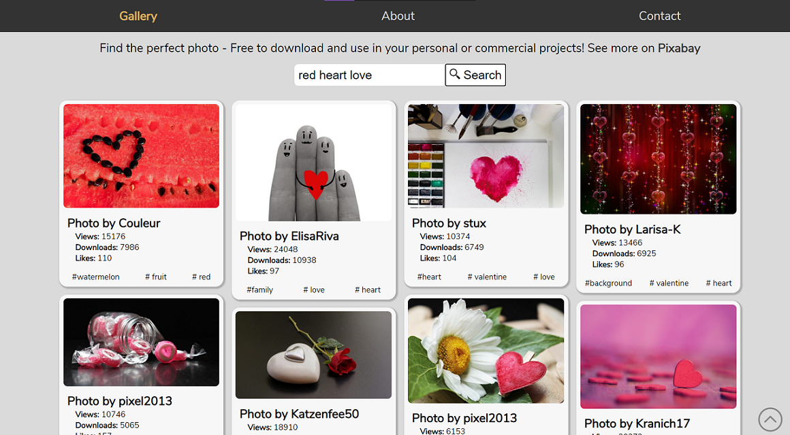

## Pixabay Photo Search Gallery <!-- omit in toc -->



## Table of Content <!-- omit in toc -->

- [About](#about)
- [Features](#features)
- [Tech used](#tech-used)
- [How to use](#how-to-use)
- [Contributing](#contributing)
- [Credits](#credits)
- [License](#license)

## About

**Lightbox** is a <a href='https://pixabay.com/'> Pixabay</a> Photo Finder! All photos are free to download and use in personal or commercial projects

## Features

React App using hooks for search function and photo display

- _Second complete project from scratch as a self-taught Front End Developer!_

Fully responsive

- _mobile and desktop devices friendly_

Main implemented features

- sticky navigation bar
- search component
- 'go back' button and functionalities
- 'scroll-to-top' button
- very simple animations for more fluent interactions

Use of

- **React** library
- **Pixabay** [API](https://pixabay.com/fr/service/about/api/)
- **Responsive Design** Media Queries

## Tech used

- **Languages** HTML5 - CSS3 - JSX React
- **Code editor** [VSCode](https://code.visualstudio.com/)
- **Version control** [Git](https://git-scm.com/)
- **Markdown** --> my VSCode [Markdown All in One](https://marketplace.visualstudio.com/items?itemName=yzhang.markdown-all-in-one) extension

## How to use

Open **[Lightbox](https://catevika.github.io/lightbox)** in your favorite browser

Enter a search term

Click on any photo of your choice to enlarge it

Right-click and 'Save as' to download it on your device

To go back to the main Gallery page, there are 3 options available:

- click the X button
- click outside of the photo
- press ESC key

Navigate to About and Contact pages to get more information about the developer

## Contributing

Pull requests are welcome

1. fork this repository

   ```
   git clone https://github.com/Catevika/lightbox.git
   ```

2. change your working directory

   ```
   cd <your working directory>
   ```

3. create your feature branch
   ```
   git checkout -b <your new feature name>
   ```
4. to start working on the created branch
   ```
   npm install
   npm start
   ```
5. commit your changes
   ```
   git commit -am 'Add some new feature'
   ```
6. Push to the branch
   ```
   git push origin <your new feature name>
   ```
7. create a new Pull Request with a simple description

Do not hesitate to ask questions, send issues or report bugs if any

Do not forget to ⭐ this project if you like it. Thank you!

## Credits

- **[Pixabay](https://pixabay.com/)**

- **Github icon** created by [Pixel perfect](https://www.flaticon.com/authors/pixel-perfect) from [Flaticon.com](https://www.flaticon.com/)

- **Twitter icon** created by [Freepik](https://www.flaticon.com/authors/freepik) from [Flaticon.com](https://www.flaticon.com/)

## License

[MIT](https://choosealicense.com/licenses/mit/) &copy; [Dominique Bello](https://twitter.com/dominique_bello) aka Catevika
